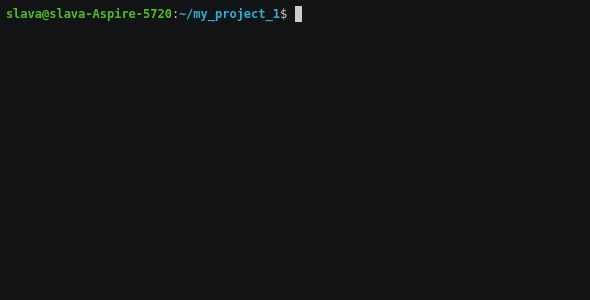

[](https://codeclimate.com/github/Viacheslav80/backend-project-lvl1/maintainability)
[](https://travis-ci.org/Viacheslav80/backend-project-lvl1)

# Brain-games clone project.

## installing
 
build the pocket.

```
$ uses_folder/make publish 
```
install pocket of global

```
$ uses_folder/sudo npm link
```

use:

```
$ brain-even
$ brain-calc
$ brain-gcd
$ brain-prime
$ brain-prograssion
```

Game-even



Game-calc


Game-gcd


Game-progression


Game-prime


